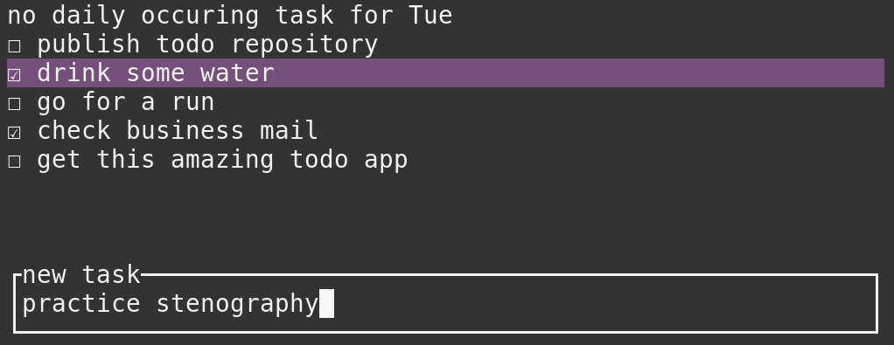

# todo
A simple todo application for the terminal.

**features:**
1. create/remove tasks
2. daily occuring tasks, depending on weekday, you can always have certain tasks appear, for example:

        monday - business day             Tuesday - Optimization day
          ☑ check business mail               ☑ Add optimization tasks for today
          ☐ taxes                             ☑ Drink water

Controlls:

    [in edit mode]
    i:   enter insert mode (make new task)
    j,k: move up or down task list.
    h,l: mark task as done / not done.
    x:   remove task
    q:   close application
        
    [in insert mode]
    [Enter]: submit new task
    [Esc]:   cancel new task, enter edit mode
